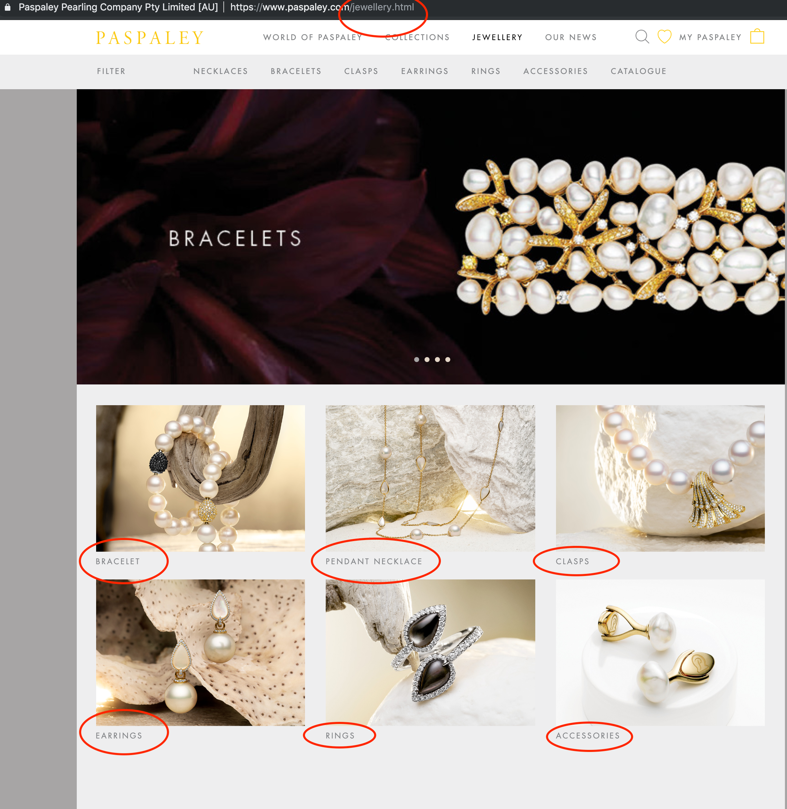

```{r setup, include=FALSE}
knitr::opts_chunk$set(echo = TRUE)
library(tidyverse)
library(scales)

# Read in the data
the_data <- read_csv("../data/cleaned_dataset.csv")
price_comparison <- read_csv("../data/price_comparison.csv")
```

# Introduction
Paspaly make the best pearl jewelry in the world. Unfortunately it's priced accordingly so actual Paspaley purchases are somewhat rare for me and I wondered if we could do some analysis. So I scraped the website on Boxing Day 2017 and again on Boxing Day 2018 which means we can have a bit of a look at what's going on.

If you'd just like to see the project folder then it's available at:https://github.com/RohanAlexander/paspaley. To be respectful of Paspaley's content, I haven't included the scraped html files there, but if you look at the Paspaley website and think there could be something in the html that I haven't taken advantage of then let me know and I can update the scripts.


# Data acquisition
## Method 1 - XML-based sitemap
There was an update to the Paspaly website at some point in 2018 where they moved away from Shopify. So I'll just focus on the most recent version of the website here, but the overall process is similar for both years. We don't want to impact the ability of their website to serve other visitors, so the first step when acquiring data from a website is to check for an API. In this case, it doesn't look like they have one. The next step is to look at the relevant robot.txt file in case they provide some guidance there: https://www.paspaley.com/robots.txt. In this case it doesn't give us much information, but it helpfully provides a link to the XML sitemap: https://www.paspaley.com/pub/sitemap.xml.

```{r, echo=FALSE, fig.cap="Screnshot of the XML file that Paspaley makes available of their sitemap."}

```

That gives us a nice list of the products on the website and their address so that we can get details such as prices. We can use the rvest package to quickly grab the relevant information from this file. 

```{r getListsOfProductsFromXML, include = TRUE, eval = FALSE}
library(rvest)
library(tidyverse)

content <- read_html("inputs/2018/sitemap.xml")

each_product <- content %>%
  xml_find_all("//url") # Instead of HTML/CSS here we're using XML. It's fairly similar, but just a slightly different syntax. Each product is within a url tag.

# Thanks to Jenny Bryan https://github.com/jennybc/manipulate-xml-with-purrr-dplyr-tidyr
all_products <- data_frame(row = seq_along(each_product), # This just adds a row numbering which makes it easier to go back and check.
                      nodeset = each_product) # Now we're pulling the relevant XML for each product into a new column. So for each product (row) the relevant nodes will be in that column.

# Thanks to James Goldie https://rensa.co/writing/drilling-into-non-rectangular-data-with-purrr/
all_products <- all_products %>% 
  mutate(product_link = nodeset %>% # We're first trying to get the URL for each product
           html_node("loc") %>%
           html_text(trim = TRUE)) %>% 
  mutate(product_name_existence_test = nodeset %>% # There's a bunch of URLs that aren't products so we want to test for whether there's a name first
           html_node("image")) %>% 
  filter(!is.na(product_name_existence_test)) %>% # Drop it if not a product
  mutate(product_name = nodeset %>% # Grab the name of the product
           html_node("image") %>% 
           html_node("title") %>% 
           html_text(trim = TRUE)) %>% 
  select(-product_name_existence_test, -nodeset)

write_csv(all_products, "outputs/misc/2018_links_from_xml.csv")
```

Although the sitemap should be giving us everything, it's worth seeing if we can use a different method to get any other information that's missing. And we'll also use this alternative information to allocate collections and categories to the products.


## Method 2 - By collection/category
Looking at the website, Paspaley organises the products by category (e.g. bracelet, earrings, etc).

```{r, echo=FALSE, fig.cap="Screnshot of the categories page."}

```

It also categorises them by collection (e.g. Monsoon, Rockpool, etc). 

```{r, echo=FALSE, fig.cap="Screnshot of the collections page."}
knitr::include_graphics("images/collection.png")
```

Save each of those summary pages and we can then scrape the links for each of the individual products from them using rvest.


```{r getListsOfProducts, include = TRUE, eval = FALSE}
library(purrr)
library(rvest)
library(tidyverse)

# We're doing it properly and writing a function. We'll pass that function, and a list of files on which to apply it, to purrr.
get_links <- function(file_to_look_at){
  content <- read_html(file_to_look_at) %>% 
    html_nodes(".product-item-info") %>% 
    html_nodes(".product") %>% 
    html_nodes("a")
  
  link <- content %>%
    html_attr("href")
  
  text <- content %>%
    html_text(trim = TRUE)
  
  collection <- str_replace(file_to_look_at, "inputs/2018/lists/lists_by_collection/", "") %>% 
    str_replace(".htm", "")
  
  return(tibble(link = link, text = text, collection = collection))
}


the_files <- c(
  "inputs/2018/lists/lists_by_collection/kimberley.htm",
  "inputs/2018/lists/lists_by_collection/lavalier.htm",
  "inputs/2018/lists/lists_by_collection/maxima.htm",
  "inputs/2018/lists/lists_by_collection/monsoon.htm",
  "inputs/2018/lists/lists_by_collection/rockpool.htm",
  "inputs/2018/lists/lists_by_collection/strand.htm",
  "inputs/2018/lists/lists_by_collection/touchstone.htm"
)


the_data <- purrr::map_df(the_files, get_links)


the_data <- the_data %>% 
  mutate(product = str_replace_all(link, c("https://www.paspaley.com/pearl-collections/the-kimberley-bracelet/" = "",
                                           "https://www.paspaley.com/pearl-collections/lavalier/" = "",
                                           "https://www.paspaley.com/pearl-collections/maxima/" = "",
                                           "https://www.paspaley.com/pearl-collections/monsoon/" = "",
                                           "https://www.paspaley.com/pearl-collections/rockpool/" = "",
                                           "https://www.paspaley.com/pearl-collections/strands/" = "",
                                           "https://www.paspaley.com/pearl-collections/touchstone/" = "")),
         year = 2018)

write_csv(the_data, "outputs/misc/2018_links_from_collections.csv")
```

You can use a similar script to get the categories. Comparing the two indicates that the XML had a handful of products that were not part of a collection or a category, but not vice versa, so no worries.

Now that we have the list of the products that we'd like details about, we need to download the page for each product. 

```{r downloadPageForEachProduct, include = TRUE, eval = FALSE}
library(rvest)
library(tidyverse)

the_data <- read_csv("outputs/2018_links_from_categories.csv")

for (i in 1:length(the_data$link)) {
  product_data <- read_html(the_data$link[i]) 
  product_name <- str_replace_all(the_data$link[i], "https://www.paspaley.com/jewellery/", "")
  product_name <- str_replace_all(product_name, "/", "-")
  name_of_file <- paste0("inputs/2018/products/", product_name, ".html") 
  write_html(product_data, file = name_of_file)
  
  print(paste(
    "Done with file number",
    i,
    "of",
    length(the_data$link),
    "at",
    Sys.time()
  ))  # Helpful updating for when running it on all the records
  Sys.sleep(60) # Space requests by 60 seconds.
}


# Clean up
rm(i, name_of_file, product_data, product_name)
```

I've spaced out the requests by 60 seconds here. Again this is just about trying to not affect the performance of their site for other visitors. I'm not in a hurry for this project, so I just slow down the requests a fair bit. In this case there were only a few hundred pages, so it was just a matter of setting the computer to run while I was busy with lunch. Not a big deal. Also, I haven't accounted for page errors, which would pause the script, like I would with a full-scale project. The way to do that is to change the scraper to a function and then to use safely on it. See upcoming blog about RBA minutes for an example.

Now that we have saved the pages for each product and we don't need to bother their website anymore we can get to organising the content into a dataset.


# Data cleaning
In the last section we downloaded the pages for each of the Paspaley products that we could find on the website. The first step to being able to analyse the data is to transform it in a format that we're more used to, such as a table.

So the task is to go through the html for each product and find the information that we are interested in: Name; Price; SKU; and Description. We're going to be using the description to get some additional information that isn't nicely laid out, such as the type of gold. The SKU is a unique identifier that will let us link products between years.  

```{r MakeDataframeFromProductsHTML, include = TRUE, eval = FALSE}
library(purrr) # Makes it easier to do the same thing to many files
library(rvest) # Goes trhough the html tags and finds what we are looking for
library(tidyverse) 

get_product_data <- function(file_to_look_at){
  # file_to_look_at <- c("inputs/2018/products/pearl-earrings-diamond-touchstone-earrings-12mm-oval-yellow-gold.html")
  # When I'm writing and testing a function I tend to insert one of the files manually here. I'm sure there's better ways to do this but this seems to work. (I normally delete it before showing anyone!)
  
  content <- read_html(file_to_look_at) %>% # read_html is an equivalent to, say, read_csv but for html files.
    html_nodes(".product-info-main") # Here we specify which set of nodes we are interested in. These are the ones that have to do with the products. You need to have a look at the html to work this out and it tends to be a bit of trial an error. 
  
    name <- content %>%
      html_nodes(".base") %>% # Focus on the node that has the name
      html_text(trim = TRUE) # This gets the text from that node - depending on what type of information you're interested in, it might not be needed.
    
    description <- content %>%
      html_nodes(".short-description") %>% 
      html_text(trim = TRUE)
    
    description <- ifelse(is_empty(description), "none", description) # Just in case they don't have a description we don't want an error.
    
    flowerydescription <- content %>%
      html_nodes(".description") %>% 
      html_text(trim = TRUE) # Some of the products have extra descriptions.
    
    flowerydescription <- ifelse(is_empty(flowerydescription), "none", flowerydescription)
    
    availability <- content %>%
      html_nodes(".stock") %>% 
      html_text(trim = TRUE)
    
    sku <- content %>%
      html_nodes(".sku") %>% 
      html_text(trim = TRUE)
    
    price <- content %>%
      html_nodes(".price") %>% 
      html_text(trim = TRUE)
    
  return(tibble(
    name = name,
    description = description,
    flowerydescription = flowerydescription,
    availability = availability,
    sku = sku,
    price = price
    )) # Here we gather everything into a table. Purrr will automatically combine the tables for each of the products.
}


products <- list.files("inputs/2018/products", full.names = TRUE) # Return a list of the the files. Handy when there are many files, otherwise just a manual list works too. You can also specify the file type or that they start/end with certain words etc. Very handy.

names(products) <- list.files("inputs/2018/products") %>% 
  gsub(pattern = ".html$", replacement = "") # This just allows us to include the names of the files in the eventual full table. You can make this better so that it doesn't list the files again (dangerous in case the order changes between listings), but for this project it's fine.

dataset <- purrr::map_df(products, # List of files
                         get_product_data, # Function to apply to each file
                         .id = "product" # Name of the column with the filenames (otherwise the content is just 1, 2, 3,...)
                         ) # 

write_csv(dataset, "outputs/2018_dataset.csv")

```

We now have the data into a table that we can work with. Unlike the usual teaching datasets, we need to clean the data so that we can apply our usual methods to them. For instance, many of the prices aren't an integer because they have AUD in front of them and some of the SKUs have SKU in front, but not all. (I've not really gone into detail about the 2017 data, and it sort of just apepars here now, but it was a similar process of getting it to here.)

```{r CleanDataframePricesandSKUs, include = TRUE, eval = FALSE}
library(stringr) # Used to make regular expressions less confronting
library(tidyverse)


# Read in the datasets
the_2018_data <- read_csv("outputs/data/2018_dataset.csv")
the_2017_data <- read_csv("outputs/data/2017_dataset.csv")


# Combine the datasets
the_2018_data$year = 2018
the_2017_data$year = 2017
the_data <- rbind(the_2017_data, the_2018_data)
rm(the_2017_data, the_2018_data)


# Fix price
the_data$price <- ?str_replace_all(the_data$price, "[\r\n]" , "") %>% 
  str_replace(".*\\$", "") # Get rid of the "Starting from..." ones - we just want a number - this is an issue with some of the 2017 ones
  
the_data$price <- str_replace_all(the_data$price, c("AUD " =  "", "," = "")) %>% 
  as.integer() # Convert to a integer - the 2018 ones start with AUD so remove that first


# Fix SKU
the_data$sku <- str_replace_all(the_data$sku, c("SKU    " =  "")) # The 2018 ones actually start with "SKU" but we just want the number
```


We'd like to be able to group the analysis by the type of item it is (necklace, earrings, etc) and by the collection (Rockpool). We can use our earlier checks to be able to get the category that Paspaley has put each item into. And we can look at the names and descriptions fields for the ones that were missing.

```{r CleanDataframeCollectionsAndCategories, include = TRUE, eval = FALSE}
# Identify the collection
# First start by using the collections in the website
links_by_collection_2018 <- read_csv("outputs/misc/2018_links_from_collections.csv")
links_by_collection_2017 <- read_csv("outputs/misc/2017_links_from_collections.csv")
links_by_collection <- rbind(links_by_collection_2017, links_by_collection_2018) %>% 
  select(collection, product, year)
rm(links_by_collection_2017, links_by_collection_2018)

the_data <- the_data %>% 
  mutate(for_matching = str_replace_all(product, c("pearl-accessories-" = "",
                                                   "pearl-bracelets-" = "",
                                                   "pearl-clasps-" = "",
                                                   "pearl-earrings-" = "",
                                                   "pearl-necklaces-" = "",
                                                   "pearl-rings-" = "")))

the_data <- the_data %>% 
  left_join(links_by_collection, by = c("year" = "year",
                                        "for_matching" = "product"))

rm(links_by_collection)

# Now, by looking at the content if it wasn't identified already
the_data <- the_data %>% 
  mutate(collection_brute_force = case_when(
    str_detect(product, "kimberley") ~ "kimberley",
    str_detect(product, "lavalier") ~ "lavalier",
    str_detect(product, "maxima") ~ "maxima",
    str_detect(product, "monsoon") ~ "monsoon",
    str_detect(product, "pearls-my-way") ~ "pearls_my_way",
    str_detect(product, "rockpool") ~ "rockpool",
    str_detect(product, "strand") ~ "strand",
    str_detect(product, "gold-keshi-rhapsody") ~ "strand", # outlier
    str_detect(product, "touchstone") ~ "touchstone",
    TRUE ~ "other"
    ))


the_data <- the_data %>% 
  mutate(collection = if_else(is.na(collection), collection_brute_force, collection)) %>% 
  select(-collection_brute_force) 

the_data$collection[the_data$collection == "pearls_my_way"] <- "Pearls My Way"
the_data$collection <- str_to_title(the_data$collection , locale = "en")


# Category
# Again, as before, looking at the website content first
links_by_categories_2018 <- read_csv("outputs/misc/2018_links_from_categories.csv")
links_by_categories_2017 <- read_csv("outputs/misc/2017_links_from_categories.csv")
links_by_categories <- rbind(links_by_categories_2017, links_by_categories_2018) %>% 
  select(category, product, year)
rm(links_by_categories_2017, links_by_categories_2018)

the_data <- the_data %>% 
  left_join(links_by_categories, by = c("year" = "year",
                                        "for_matching" = "product"))

the_data <- the_data %>% 
  mutate(category_brute_force = case_when(
    str_detect(product, "accessories") ~ "Accessory",
    str_detect(product, "bracelets") ~ "Bracelet",
    str_detect(product, "clasps") ~ "Clasp",
    str_detect(product, "earrings") ~ "Earrings",
    str_detect(product, "necklaces") ~ "Necklace",
    str_detect(product, "rings") ~ "Ring",
    str_detect(product, "petite-circle-strand") ~ "Necklace",
    str_detect(product, "baroque-strand") ~ "Necklace",
    str_detect(product, "gold-keshi-rhapsody") ~ "Necklace",
    str_detect(product, "keshi-rope-strand-of-the-harvest") ~ "Necklace",
    TRUE ~ "Other"
  ))

the_data <- the_data %>% 
  mutate(category = if_else(is.na(category), category_brute_force, category)) %>% 
  select(-category_brute_force) 

the_data$category[the_data$category == "necklaces_and_pendants"] <- "Necklaces and Pendants"
the_data$category[the_data$category == "Necklace"] <- "Necklaces and Pendants"
the_data$category[the_data$category == "necklaces"] <- "Necklaces and Pendants"

the_data$category <- str_to_title(the_data$category , locale = "en")
```

We think that there might be a difference between keshi pearls and non-keshi pearls. (My knowledge here is based solely on what Paspaley salespeople have told me, but I think that Keshi form naturally so they don't have a little round ball in the middle of them, whereas non-keshi have been implanted and then the oyster coats it with the pearl substance.) We'd also like to pull out the shape of the pearl (round, triangle, etc), and the metal (white gold, rose gold, etc).

```{r CleanDataframeKeshiMetal, include = TRUE, eval = FALSE}
# Identify whether keshi pearl
the_data <- the_data %>% 
  mutate(keshi = case_when(
    str_detect(product, "keshi") ~ TRUE,
    str_detect(name, "Keshi") ~ TRUE,
    str_detect(description, "Keshi") ~ TRUE,
    str_detect(description, "keshi") ~ TRUE,
    TRUE ~ FALSE
  ))


# Metal
the_data <- the_data %>% 
  mutate(metal = case_when(
    str_detect(name, "White Gold") ~ "White gold",
    str_detect(name, "Yellow Gold") ~ "Yellow gold",
    str_detect(name, "Rose Gold") ~ "Rose gold",
    str_detect(name, "Platinum") ~ "Platinum",
    str_detect(description, "white gold") ~ "White gold",
    str_detect(description, "yellow gold") ~ "Yellow gold",
    str_detect(description, "rose gold") ~ "Rose gold",
    str_detect(description, "platinum") ~ "Platinum",
    TRUE ~ "Other"
  ))

# Pearl type
the_data <- the_data %>% 
  mutate(description_lowered = str_to_lower(description)) %>% 
  mutate(pearl_type = case_when(
    str_detect(description_lowered, "mother-of-pearl") ~ "Mother of pearl",
    str_detect(description_lowered, "mother of pearl") ~ "Mother of pearl",
    str_detect(description_lowered, "triangle pearl") ~ "Triangle",
    str_detect(description_lowered, "round pearl") ~ "Round",
    str_detect(description_lowered, "button pearl") ~ "Button",
    str_detect(description_lowered, "semi-round pearl") ~ "Semi-round",
    str_detect(description_lowered, "drop pearl") ~ "Drop",
    str_detect(description_lowered, "circle pearl") ~ "Circle",
    str_detect(description_lowered, "oval pearl") ~ "Oval",
    str_detect(description_lowered, "round australian south sea pearl") ~ "Round",
    str_detect(description_lowered, "round paspaley pearls") ~ "Round",
    str_detect(description_lowered, "oval drop australian south sea pearls") ~ "Oval",
    str_detect(description_lowered, "oval australian south sea pearl") ~ "Oval",
    str_detect(description_lowered, "button australian south sea pearl") ~ "Button",
    TRUE ~ "Unsure"
  )) %>% 
  select(-description_lowered)

```

Finally, in anything that is written there are always typos and mistakes that fresh eyes notice, but that the author could read a thousand times and miss. So we'd like to fix a bit of the website content, so that they don't continue into our dataset.

```{r CleanDataframeTypos, include = TRUE, eval = FALSE}
# Fix typos and inconsistencies
the_data$description <- str_replace_all(the_data$description, "in18kt", "in 18kt")
the_data$description <- str_replace_all(the_data$description, "18ct white gold", "18kt white gold") # Google says that ct refers to weight and kt refers to purity, so should be 18kt white gold etc?
the_data$description <- str_replace_all(the_data$description, "18ct yellow gold", "18kt yellow gold")
the_data$description <- str_replace_all(the_data$description, "pearl  bracelet", "pearl bracelet")
the_data$description <- str_replace_all(the_data$description, "feturing", "featuring")
the_data$description <- str_replace_all(the_data$description, "Papsaley", "Paspaley") # Frankly, I'm suprised this didn't happen more often
the_data$name <- str_replace_all(the_data$name, "Oval  - Yellow Gold", "Oval - Yellow Gold")
the_data$name <- str_replace_all(the_data$name, "Baroque  - White Gold", "Baroque - White Gold")
the_data$name <- str_replace_all(the_data$name, "Oval  - White Gold", "Oval - White Gold")
the_data$description <- str_replace_all(the_data$description, "extrodinary", "extraordinary")
the_data$description <- str_replace_all(the_data$description, "feauturing", "featuring")
the_data$description <- str_replace_all(the_data$description, "fourty-eight", "forty-eight")
the_data$description <- str_replace_all(the_data$description, "featruing", "featuring")
the_data$description <- str_replace_all(the_data$description, "fotry-eight", "forty-eight")
the_data$description <- str_replace_all(the_data$description, "suprisingly", "surprisingly")
the_data$description <- str_replace_all(the_data$description, "\\.(?=[:upper:][:lower:])", ". ") # There's a bunch with no space following the full stop at the end of the sentence.
the_data$description <- str_replace_all(the_data$description, "\\.(?=A)", ". ")
the_data$description <- str_replace_all(the_data$description, "Freah", "Fresh")
the_data$description <- str_replace_all(the_data$description, "ninty", "ninety")
the_data$description <- str_replace_all(the_data$description, "Introducing Pearls My Way\\. Tailor your look by choosing your preferred Australian South Sea pearls and earring hooks in your favourite shade of gold. Add some colour to your earrings with a variety of precious gemstones including rubies and diamonds\\. Prefer to create your own Pearls My Way earrings\\? Contact the Personal Shopper or visit your nearest boutique. Personal Shopper Recommendation:", "")
the_data$description <- str_replace_all(the_data$description, "Introducing Pearls My Way\\. Tailor your look by choosing your preferred Australian South Sea pearls and earring hooks in your favourite shade of gold\\. Add some colour to your earrings with a variety of precious gemstones including rubies and diamonds\\. Prefer to create your own Pearls My Way earrings\\? Contact Personal Shopper or visit your nearest boutique\\. Personal Shopper Recommendation:", "")

the_data <- the_data[-160,] # For some reason Odyssey Swap is in there twice for 2017. I know you're not meant to do the removal this way, but here we are.

# Combine the description and the flowery description (2018 has the split, but 2017 doesn't)
the_data <- the_data %>% 
  unite(description, description, flowerydescription, sep = " ") 

# Save the data
write_csv(the_data, "outputs/data/cleaned_dataset.csv")
```


# Data analysis
## Number of products
This is just a 'fun' analysis - we don't have all the data (only what they put on the website). If you just want the cleaned dataset then you can get it here: https://github.com/RohanAlexander/paspaley/blob/master/outputs/data/cleaned_dataset.csv

The first thing that jumps out is that the number of items on the website has decreased from 276 in 2017 to 179 in 2018. 

```{r, include = TRUE}
# Number per year
the_data %>% group_by(year) %>% count()
```

That's despite the fact that Paspaley introduced a whole new collection - Monsoon - this year which has 33 products on the website. Looking at the counts by collection suggests what is going on - there has been a decrease in the number of 'Other' products. For instance, in 2017 the website had gift vouchers, but these aren't on the website (or at least I couldn't find them) in 2018.

```{r, include = TRUE}
# Number per year per collection
the_data %>% 
  group_by(year, collection) %>% 
  count() %>% 
  spread(year, n)
```

Lavalier has also decreased from 27 to 10. Comparing the website at 2017 with 2018, it's clear that they've changed they way they are presenting Lavalier from jewelry that was sold as it was, to something that is customised by the customer (i.e. choosing the pearl etc). Strand and Pearls My Way also seem to have decreased a little, but those two were always a little less amenable to this type of analysis. Strand just because they understandably don't really put much on their website about the pearl strands, and Pearls My Way, because it's meant to be customised.

Maybe Paspaley has changed how they are using their website? Perhaps it has gone from acting as a place of commerce (e.g. being able to buy gift vouchers on it) to being something that feels more about allowing people to engage with the brand in a less financial way, perhaps as a complement to their Instagram account, but you still go into the stores when you want to buy.

Based on having identical SKUs, there are 77 products that are on the 2017 and 2018 versions of the website. 

```{r, include = TRUE}
product_in_both_years <- the_data %>% 
  select(sku, year, price) %>% 
  group_by(sku) %>% 
  spread(key = year, value = price) %>% 
  rename(price_in_2017 = `2017`, price_in_2018 = `2018`) %>% 
  filter(!is.na(price_in_2018) & !is.na(price_in_2017)) %>% 
  left_join(the_data[the_data$year == 2018,], by = "sku") %>% 
  select(sku, product, collection, category) %>% 
  ungroup()

product_in_both_years %>% 
  count(category) 

product_in_both_years %>% 
  count(collection) 
```

The most common category of product to be on the website in both years is necklaces and pendants, followed by earrings. The distribution between the collections is also surprising, with other being the most popular, but Maxima and Rockpool being next.

## Prices

Even though Paspaley has a lot of products at that it doesn't sell through the website, the prices that are shown on the website are still fairly high!

```{r, include = TRUE}
ggplot(data = the_data, aes(x = price, fill = collection)) +
  geom_histogram(binwidth = 1000) +
  facet_wrap(vars(year), nrow = 2) +
  theme_classic() +
  scale_fill_viridis_d() +
  scale_x_continuous(labels = comma) # The scales library is used here - it just gets away from scientific notation
```

There is a large skew - in 2018 there were five products with a price over \$100,000; down from seven in 2017. Interestingly if we focus on products that have a price less than \$50,000 we again see this skew, although at this less expensive level it's being driven by the 'other' collection These tends to be products such as clasps or chains.

```{r, include = TRUE}
ggplot(data = the_data[the_data$price < 50000,], aes(x = price, fill = collection)) +
  geom_histogram(binwidth = 1000) +
  facet_wrap(vars(year), nrow = 2) +
  theme_classic() +
  scale_fill_viridis_d() +
  scale_x_continuous(labels = comma)
```

If we get rid of the 'other' collection then the distribution is a lot less skewed.
```{r, include = TRUE}
ggplot(data = the_data[the_data$collection != "Other",], aes(x = price, fill = collection)) +
  geom_histogram(binwidth = 1000) +
  facet_wrap(vars(year), nrow = 2) +
  theme_classic() +
  scale_fill_viridis_d() +
  scale_x_continuous(labels = comma)
```

We can use a boxplot to foxus on the distribution by collection.

```{r, include = TRUE}
the_data %>% 
  filter(!collection %in% c("Pearls My Way", "Strand")) %>% 
  ggplot(aes(collection, log(price))) +
  geom_boxplot() +
  facet_wrap(vars(year), nrow = 2) +
  theme_classic() 
```

In that plot, I've logged the price, which is a little confusing to interpret, allows us to see pretty clearly that the collections are aimed at different price points. For instance, Kimberly being cheaper, Lavalier and Touchstone being moderate, and Maxima and Rockpool being high. The Monsoon collection, which was new in 2018 is at an interesting price point, with a few products being (relatively) cheaper, but most of them being at the high end, even by Paspaley prices. I think that the summary prices for 'Pearls My Way' and 'Strand' are too dependent on what Paspaley has put on the website to be worth going into.

Finally, surprisingly there isn't really too much difference between the average price of different categories, although clasps are surprisingly expensive.

```{r, include = TRUE}
the_data %>% 
  filter(!category %in% c("Other", "Strands")) %>% 
  ggplot(aes(category, log(price))) +
  geom_boxplot() +
  facet_wrap(vars(year), nrow = 2) +
  theme_classic() 
```


Somewhat surprisingly the average price for many of the collections has decreased slightly in 2018, compared with 2017. For instance, Kimberley from \$2,320 to \$2013 or Touchston from \$11,687 to \$8,258. This decrease in the average is despite an increase in the maximum in many cases. 

```{r, include = TRUE}
the_data %>% 
  group_by(year, collection) %>% 
  summarise(average = mean(price) %>% as.integer(),
            maximum = max(price) %>% as.integer(),
            minimum = min(price) %>% as.integer(),
            number = n()
            ) %>% 
  filter(collection %in% c("Kimberley", "Lavalier", "Maxima", "Monsoon", "Rockpool", "Touchstone")) 
```


As mentioned earlier, there were 75 products with the same SKU and in both years. This allows us to directly compare the price difference between the years.

```{r, include = TRUE}
price_comparison %>% 
  mutate(l_price_in_2017 = log(price_in_2017),
         l_price_in_2018 = log(price_in_2018)) %>% 
  ggplot(aes(y = l_price_in_2017, x = l_price_in_2018)) +
  geom_jitter() +
  theme_classic() 
```


```{r, include = TRUE}
price_comparison %>% 
  arrange(percent_change) %>% 
  ggplot(aes(y = percent_change, x = 1)) +
  geom_jitter() +
  theme_classic() +
  theme(axis.title.x=element_blank(),
        axis.text.x=element_blank(),
        axis.ticks.x=element_blank())
```

The largest price increase was for the pearl cufflinks which increased from \$2,780 to \$3,280, or roughly 18 per cent. The next largest increase was the Maxima pearl rope necklace in yellow gold which increased by 17 per cent from \$29,800 to \$34,800. Surprisingly there were 30 items that have the same price, and six that actually decreased in price. The product with the largest price decrease were the Rockpool cluster earrings in platinum which decreased by 30 per cent from \$12,800 to be a relative bargain at \$8,800. Of the six products with a price decrease, four of them were Lavalier necklaces and pendants. With the white and yellow gold versions of the of the circle pearl necklace decreasing from \$6,160 to \$5,160 and the petite version also decreasing from \$3,960 to \$3,860.


# Weaknesses
The main weakness of the analysis is that it's just based on what I could find on the website. With a better dataset we could do more interesting analysis and be more confident in our results.
